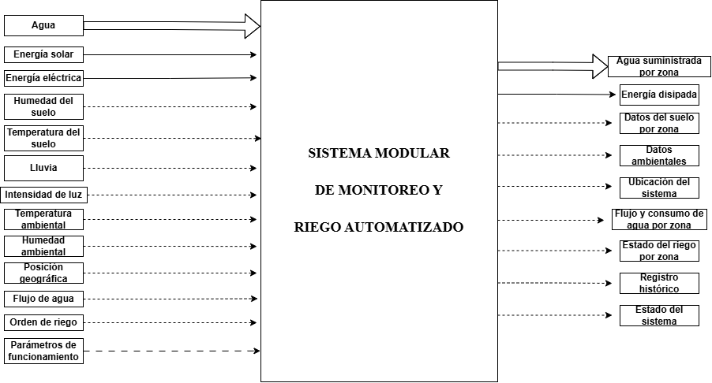
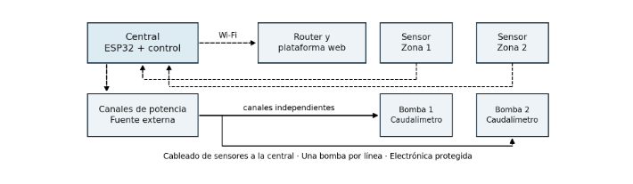
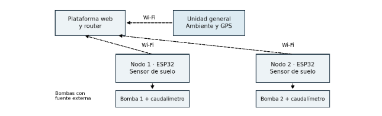
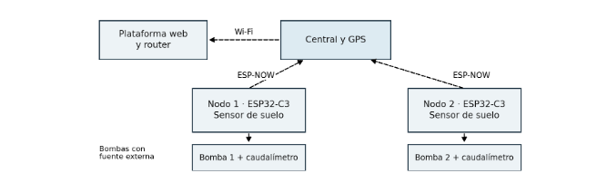
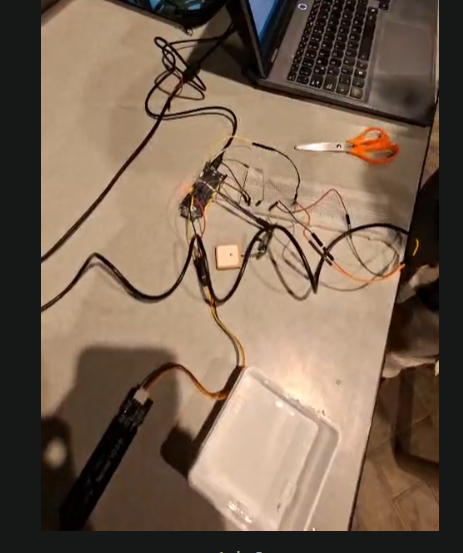
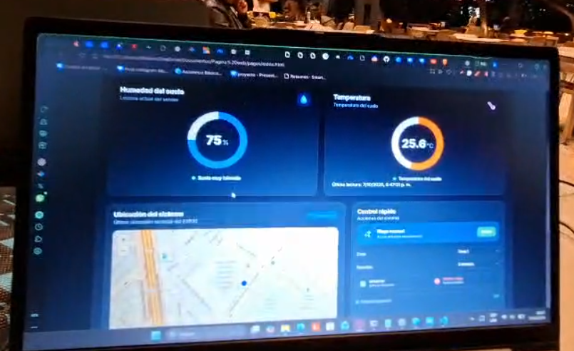

UNIVERSIDAD PERUANA CAYETANO HEREDIA

Fundamentos de Diseño 2026 2

# Informe técnico del sistema modular de monitoreo y riego

Entregable 2

Áreas verdes de San Martín de Porres
Equipo 15 · 7 de octubre de 2026

### Integrantes

Kenneth Samir Ramos Espinoza

Giordano Valentino Valero Bonifacio

Leonardo Pedro Espinoza Flores

Josue Ismael Cardenas Luna

Leonel Willians Sotelo Mamani

### Resumen

Se propone un sistema modular para medir las condiciones del suelo por zona, gestionar líneas de riego independientes y registrar el consumo de agua. La investigación se organiza en seis publicaciones de patentes, tres artículos científicos, tres productos comerciales y tres tesis. A partir de sus aportes se formulan exigencias, se representa la función global y se presentan tres bocetos preliminares para la comparación de conceptos.

La propuesta de desarrollo contempla módulos de zona y una central de comunicaciones; la comparación de alternativas conduce a seleccionar la comunicación ESP-NOW entre nodos y central, con Wi-Fi hacia la plataforma. El avance actual integra adquisición de humedad y temperatura del suelo, posición GPS y envío a Supabase con visualización web. La integración multizona, el accionamiento hidráulico, la calibración y la comparación de consumo constituyen las siguientes etapas de validación.

El informe presenta decisiones de diseño y avance funcional. No atribuye al prototipo porcentajes de ahorro, precisión de medición ni autonomía que todavía no hayan sido determinados experimentalmente.

## 1 Problema y objetivos

La gestión del agua destinada a áreas verdes resulta relevante para Lima por la concentración de población en la vertiente del Pacífico. La ANA informó que esta vertiente concentra el 66 % de la población peruana y dispone del 2,2 % del agua superficial nacional [1](#ref-1). Estas cifras describen un contexto territorial; no constituyen una medición del desperdicio de agua en parques.

En San Martín de Porres, la municipalidad reportó más de 650 parques y la incorporación de riego tecnificado en Stella Maris [2](#ref-2). El distrito constituye el ámbito de aplicación propuesto. El montaje de banco no representa todavía una instalación validada en ese parque ni en otro espacio municipal.

Dentro de una misma área verde, la exposición solar, la vegetación y las condiciones del suelo pueden producir necesidades de riego diferentes. Aplicar un único criterio a todos los sectores puede no responder a esa variación. Además, sin registrar el volumen utilizado por línea resulta difícil comparar objetivamente métodos de riego.

### Pregunta de diseño

¿Cómo monitorear y gestionar el riego por zonas en áreas verdes de San Martín de Porres, registrando el agua utilizada y permitiendo una instalación modular?

### Objetivo general

Desarrollar un sistema modular de monitoreo y riego por zonas que utilice mediciones del suelo para apoyar decisiones de riego y permita registrar información de funcionamiento y consumo.

### Objetivos específicos

- Adquirir y visualizar humedad y temperatura del suelo asociadas a una zona.

- Centralizar la información y conservar registros con fecha y hora para su consulta web.

- Integrar canales de riego independientes y medición de caudal por línea.

- Validar las mediciones y comparar el consumo frente a una condición de referencia bajo condiciones comparables.

### Relación con los ODS y método de diseño

El eje principal es la meta 6.4 del ODS 6, relacionada con la eficiencia en el uso del agua [3](#ref-3). La innovación tecnológica y el mantenimiento de áreas verdes vinculan también la propuesta con los ODS 9 y 11. El prototipo utilizará indicadores propios, como litros por zona y duración del riego; no calcula directamente los indicadores oficiales de Naciones Unidas.

El proceso sigue la secuencia de trabajo VDI empleada en el curso: precisar el problema, establecer exigencias, descomponer funciones, generar alternativas, evaluar conceptos e integrar y verificar subsistemas. La trazabilidad relaciona cada exigencia con una función y una prueba; no se presenta como una certificación de cumplimiento de una norma VDI.

## 2 Estado de la tecnología

### 2.1 Patentes y principios de solución

Se revisan seis publicaciones para identificar funciones aplicables y diferencias respecto a la propuesta. Una patente documenta una solución técnica; su existencia no demuestra por sí sola el desempeño de nuestro prototipo.

| Publicación | Principio técnico | Aporte al proyecto | Diferencia o límite |
| --- | --- | --- | --- |
| WO2009010613A1 [4](#ref-4) | Gestión centralizada de dispositivos de riego distribuidos. | Concentrar supervisión y datos en una central. | Su red y actuadores difieren de los ESP32 y bombas seleccionados. |
| US8948921B2 [5](#ref-5) | Programación adaptada a condiciones del sitio y del clima. | Utilizar parámetros de zona al decidir el riego. | La primera versión utiliza umbrales; no reproduce todo su algoritmo. |
| US9588030B2 [6](#ref-6) | Sensor diédrico para evaluar propiedades del agua. | Distinguir la variable de interés del principio de medición. | Su principio es distinto del sensor capacitivo del montaje. |
| US8104498B2 [7](#ref-7) | Integración de medición de humedad y controlador. | Relacionar humedad medida con permiso o interrupción de riego. | El circuito patentado no equivale al circuito de la propuesta. |
| US10969798B2 [8](#ref-8) | Estimación de necesidades y tiempos de riego. | Definir parámetros para gestionar cada zona. | El método es más complejo que la comparación inicial por umbrales. |
| US20250048979A1 [9](#ref-9) | Sensores distribuidos y programación informada por datos. | Organizar medición inalámbrica y centralización. | Es una publicación de solicitud. Su IA queda fuera del alcance inicial. |

### Síntesis del análisis

Los aportes convergen en tres decisiones: adquirir información representativa por zona, utilizar parámetros explícitos y coordinar la supervisión. La propuesta conserva estos principios con una implementación acotada a los componentes disponibles. No adopta de manera automática radios, válvulas, sensores o modelos computacionales de las patentes.

El sensor capacitivo se selecciona para la prueba inicial por disponibilidad y facilidad de integración analógica. Su calibración debe relacionar la señal eléctrica con referencias de humedad del suelo de aplicación. La lectura escalada del ADC no equivale al potencial hídrico medido por otros principios.

### 2.2 Artículos y productos comerciales

| Artículo | Aporte | Aplicación y límite |
| --- | --- | --- |
| Singh et al 2024 [10](#ref-10) | Control autónomo mediante humedad del suelo en césped. | Orienta parámetros y validación. El suelo, vegetación y agua reciclada del estudio son condiciones propias. |
| Falamba et al 2026 [11](#ref-11) | Integración de sensores, caudal, energía solar y control por umbrales. | Orienta pruebas de subsistemas y comparación de consumo. Su ensayo se realiza en tomate de invernadero. |
| Liu y Jensen 2018 [12](#ref-12) | Infraestructura verde y gestión urbana del agua. | Incorpora instalación y mantenimiento al análisis. No valida un controlador electrónico específico. |

La evidencia científica orienta cómo evaluar el sistema, pero no permite trasladar porcentajes de ahorro de otro entorno al prototipo. La comparación propia requerirá suelo, vegetación, duración de prueba y condiciones de riego suficientemente comparables.

### Productos comerciales

| Producto | Función relevante | Aprendizaje de diseño |
| --- | --- | --- |
| Rain Bird ARC [13](#ref-13) | Gestión de estaciones, programación y supervisión por aplicación. | Identificar zonas y facilitar cambios de programación. |
| Rachio 3 [14](#ref-14) | Supervisión remota y programación relacionada con condiciones climáticas. | Presentar información útil para decidir y seguir el estado del riego. |
| Orbit B hyve con hub [15](#ref-15) | Control de un punto de riego conectado a una manguera. | Considerar montaje hidráulico y ubicación de cada punto de control. |

Los productos muestran funciones consolidadas de supervisión y programación. No se presupone compatibilidad eléctrica entre sus actuadores y una bomba de prueba de 5 V. Su evaluación aporta criterios de uso e instalación, sin convertir características comerciales en resultados propios.

### 2.3 Tesis y trazabilidad de los hallazgos

| Tesis | Aporte | Diferencia frente al proyecto |
| --- | --- | --- |
| Ruiz 2025 [16](#ref-16) | Integra sensores, procesamiento central, panel web y control manual. | Emplea Arduino, Raspberry Pi y LSTM. La propuesta no requiere predicción con IA. |
| Olemukan 2025 [17](#ref-17) | Nodo de monitoreo con energía solar, radio y validación del sensor. | Usa LoRa y medición tensiométrica. Su desempeño no prueba el alcance ni la autonomía de un C3. |
| Villa Longa 2020 [18](#ref-18) | Diseño de red de sensores y nube para parques municipales de Lima. | Aporta contexto local y arquitectura. No sustituye el ensayo físico de nuestro montaje. |

### Factores comunes y decisiones derivadas

| Hallazgo | Decisión en el sistema | Cómo se comprobará |
| --- | --- | --- |
| Medición por sector | Un módulo identificable por zona. | Variar una zona y observar el registro correspondiente. |
| Parámetros de riego | Comparación local con límites configurados. | Ensayar valores a ambos lados de cada límite. |
| Supervisión y registro | Central y plataforma web con historial. | Contrastar lectura, registro y visualización. |
| Medición del agua | Caudalímetro por línea. | Comparar volumen calculado con volumen recogido. |
| Alimentación autónoma | Estudiar solar y batería para monitoreo. | Medir corriente y energía durante el ciclo real. |
| Instalación mantenible | Separación del agua y módulos reemplazables. | Inspeccionar montaje y realizar sustitución de un módulo. |

La modularidad se considera una respuesta a la heterogeneidad del área verde y a la necesidad de ampliar el sistema. No supone que ya se haya validado un número determinado de zonas, alcance de radio o tiempo de autonomía.

## 3 Lista de exigencias

La lista de exigencias reúne las condiciones que tiene que cumplir el sistema y separa los requisitos obligatorios de los deseos de diseño.

| N.° | Tipo | Exigencia | Especificación / criterio verificable |
|:---:|---|---|---|
| 1 | Exigencia | Medición de humedad del suelo | Cada zona contará con un sensor de humedad del suelo conectado a su módulo de medición. |
| 2 | Exigencia | Medición de temperatura del suelo | Cada zona contará con medición de temperatura del suelo. |
| 3 | Exigencia | Módulos de medición por zona | Cada zona utilizará un ESP32-C3 SuperMini para adquirir y procesar las mediciones locales. |
| 4 | Exigencia | Módulo central | El sistema contará con un ESP32-S3 como módulo central para recibir datos de los módulos de zona y comunicarse con la plataforma. |
| 5 | Exigencia | Detección de lluvia | El módulo central deberá detectar presencia de lluvia. |
| 6 | Exigencia | Medición de luz ambiental | El módulo central deberá medir la intensidad de luz ambiental. |
| 7 | Exigencia | Temperatura y humedad ambiental | El módulo central deberá medir temperatura y humedad del ambiente. |
| 8 | Exigencia | Posición geográfica | El módulo central deberá obtener la ubicación mediante GPS. |
| 9 | Exigencia | Comunicación entre módulos | Los módulos de zona deberán comunicarse con el módulo central mediante ESP-NOW. |
| 10 | Exigencia | Comunicación con la plataforma | El módulo central deberá conectarse por Wi-Fi para enviar datos a la plataforma web. |
| 11 | Exigencia | Frecuencia de actualización | La información del sistema deberá actualizarse en intervalos de hasta 5 minutos durante la operación normal. |
| 12 | Exigencia | Identificación de zonas | Cada módulo y cada registro deberán estar asociados a una zona identificable. |
| 13 | Exigencia | Riego independiente | El sistema deberá permitir activar o detener el riego de cada zona de manera independiente. |
| 14 | Exigencia | Bomba por línea de riego | Cada línea o zona de riego contará con una bomba independiente. |
| 15 | Exigencia | Coordinación de múltiples bombas | El módulo central deberá coordinar varias bombas mediante órdenes independientes a los controladores de zona, con una bomba asociada a cada zona. |
| 16 | Exigencia | Alimentación de bombas | Las bombas utilizarán una fuente eléctrica directa independiente de la alimentación solar de los módulos de monitoreo. |
| 17 | Exigencia | Medición de caudal | Cada línea de riego contará con medición de caudal ubicada en la salida o boquilla de la manguera. |
| 18 | Exigencia | Separación del agua y electrónica | Los controladores y componentes electrónicos deberán mantenerse protegidos y alejados de las salidas de agua. |
| 19 | Exigencia | Control remoto | La plataforma deberá permitir solicitar la activación o detención del riego de una zona seleccionada. |
| 20 | Exigencia | Control automático | El sistema deberá poder decidir el riego utilizando las mediciones y los parámetros configurados para cada zona. |
| 21 | Exigencia | Monitoreo por zona | La plataforma deberá mostrar como mínimo humedad del suelo, temperatura del suelo, estado de riego y consumo de agua por zona. |
| 22 | Exigencia | Monitoreo ambiental y ubicación | La plataforma deberá mostrar lluvia, luz, temperatura y humedad ambiental, además de la ubicación del sistema. |
| 23 | Exigencia | Registro histórico | El sistema deberá almacenar como mínimo zona, fecha, hora, mediciones, estado de riego y volumen de agua registrado. |
| 24 | Exigencia | Alimentación autónoma de monitoreo | Los módulos de monitoreo deberán utilizar panel solar y batería recargable. |
| 25 | Exigencia | Gestión de energía | Los módulos deberán incluir gestión de carga y estrategias de bajo consumo cuando no estén realizando mediciones o transmisiones. |
| 26 | Exigencia | Protección para exteriores | La electrónica de los módulos exteriores deberá instalarse en una cubierta que la proteja de humedad y salpicaduras. |
| 27 | Exigencia | Validación de mediciones | Las mediciones deberán comprobarse bajo condiciones diferenciadas de humedad y temperatura para verificar que el sistema detecta cambios reales. |
| 28 | Exigencia | Validación del riego independiente | En las pruebas deberá comprobarse que una orden destinada a una zona activa únicamente la bomba correspondiente. |
| 29 | Exigencia | Comparación de consumo | El sistema deberá registrar litros por zona para comparar el consumo del riego propuesto con un método de referencia bajo condiciones comparables. |
| 30 | Deseo | Escalabilidad | Se desea poder añadir nuevas zonas sin rediseñar completamente el sistema. |
| 31 | Deseo | Facilidad de mantenimiento | Se desea que sensores, módulos y elementos de riego puedan revisarse o sustituirse sin desmontar todo el sistema. |
| 32 | Deseo | Bajo costo | Se desea reducir el costo de componentes e instalación sin impedir el cumplimiento de las exigencias obligatorias. |
| 33 | Deseo | Facilidad de instalación | Se desea que los módulos puedan instalarse con pocas modificaciones en el área verde seleccionada. |
| 34 | Deseo | Diseño compacto | Se desea mantener un tamaño reducido en los módulos para facilitar su instalación y protección. |

## 4 Caja negra y secuencia de operaciones

La función global consiste en monitorear condiciones y gestionar el riego por zonas. La caja negra representa intercambios de materia, energía e información sin anticipar la solución interna.

*Figura 1. Caja negra y tipos de flujo. Elaboración propia.*

El agua suministrada es materia, mientras que el caudal medido y el volumen registrado son señales. La información del entorno representa, en este nivel de abstracción, las condiciones físicas que se sensarán dentro del sistema. Las señales digitales entre sensor y controlador son internas a la frontera.

### Secuencia del usuario y del dispositivo

| Paso | Usuario | Dispositivo |
| --- | --- | --- |
| 1 | Instala e identifica las zonas. | Inicia y verifica componentes. |
| 2 | Configura parámetros y modo. | Adquiere y valida lecturas. |
| 3 | Consulta las mediciones. | Centraliza datos y actualiza plataforma. |
| 4 | Supervisa o solicita riego manual. | Evalúa condición y selecciona el canal. |
| 5 | Revisa consumo o detiene. | Acciona, mide caudal, detiene y registra. |

Si una lectura es inválida, el sistema debe señalar la falla e inhibir una decisión automática basada en ella. Esta lógica corresponde a la operación integrada prevista; la demostración actual se concentra en adquisición y transmisión.

## 5 Estructura de funciones

La función global se descompone en cinco dominios: interfaz, control, electrónica, mecánica y energía. La información adquirida en las zonas y en la central alimenta la decisión de riego. La orden de control acciona la bomba correspondiente, mientras la medición de caudal permite registrar el volumen suministrado.

*Figura 2. Descomposición funcional del sistema modular de monitoreo y riego.*

| Dominio | Subfunciones | Entradas | Salidas |
| --- | --- | --- | --- |
| Interfaz | Recibir configuración y órdenes manuales; mostrar mediciones, estado e historial. | Parámetros, órdenes y registros. | Solicitudes de operación e información al usuario. |
| Control | Validar datos; comparar con límites; determinar necesidad de riego; seleccionar zona; emitir orden; calcular consumo. | Mediciones identificadas, parámetros, caudal y tiempo. | Orden de activación o detención y volumen calculado. |
| Electrónica de zona | Adquirir humedad y temperatura del suelo; transmitir datos; accionar la etapa de potencia; contar pulsos de caudal. | Señales de sensores, órdenes y energía eléctrica. | Mediciones por zona y accionamiento de la bomba. |
| Electrónica central | Adquirir variables ambientales y GPS; recibir datos; coordinar zonas; comunicar con la plataforma. | Datos de nodos, señales ambientales y solicitudes web. | Registros consolidados y órdenes identificadas. |
| Mecánica | Recibir agua; conducirla; distribuirla por líneas; suministrarla a cada zona; proteger componentes. | Agua disponible y accionamiento del bombeo. | Agua suministrada por zona. |
| Energía | Captar, almacenar y regular energía para monitoreo; alimentar por separado las bombas. | Energía solar y fuente eléctrica externa. | Alimentación de electrónica y potencia de bombeo. |

El recorrido de información es **adquirir → validar → transmitir → centralizar → comparar → seleccionar zona → ordenar → medir caudal → registrar**. El agua sigue el recorrido hidráulico; la energía alimenta sensores, procesadores y actuadores. El cálculo de consumo utiliza caudal y tiempo de funcionamiento, no únicamente la emisión de una orden de riego.

## 6 Matrices morfológicas y conceptos de solución

Las matrices relacionan cada función con medios alternativos de realización. Las opciones se combinan considerando compatibilidad eléctrica, hidráulica, de comunicación y de control. La exploración incluye alternativas distintas a la arquitectura finalmente seleccionada para identificar sus ventajas y limitaciones.

### 6.1 Dominio electrónico

| Función | Alternativa 1 | Alternativa 2 | Alternativa 3 |
| --- | --- | --- | --- |
| Medir humedad del suelo | Sensor capacitivo analógico. | Sensor resistivo de suelo. | Sensor de potencial matricial con interfaz de lectura. |
| Medir temperatura del suelo | Sonda digital compatible con OneWire. | Termistor con lectura analógica. | Sensor de resistencia con acondicionamiento. |
| Medir caudal | Turbina y pulsos Hall. | Medidor electromagnético. | Medidor ultrasónico. |
| Procesar señales | Microcontrolador ESP32. | Computadora de placa única. | Microcontrolador con módulo de comunicación externo. |
| Conectar zonas con la central | Sensores cableados a central. | Nodos conectados mediante red Wi-Fi. | Nodos ESP32-C3 con ESP-NOW. |
| Comunicar con plataforma | Wi-Fi. | Ethernet con interfaz adicional. | Módem celular con servicio de datos. |
| Accionar bomba de corriente continua | Etapa MOSFET compatible con la señal de control. | Relé con etapa de excitación. | Controlador electrónico integrado para motor. |

La elección de un componente requiere contrastar alimentación, niveles de señal, intervalo de medida y condiciones de instalación. La presencia de una tecnología en la matriz no implica compatibilidad directa con los componentes del banco.

### 6.2 Dominio mecánico

| Función | Alternativa 1 | Alternativa 2 | Alternativa 3 |
| --- | --- | --- | --- |
| Disponer de agua | Depósito compartido. | Depósito independiente por zona. | Red presurizada con regulación apropiada. |
| Conducir agua | Manguera flexible. | Tubería rígida. | Combinación de tubería y tramos flexibles. |
| Regular suministro por zona | Bomba independiente por línea. | Bomba compartida y electroválvula por zona. | Red presurizada y válvula por zona. |
| Aplicar agua | Salida dirigida de manguera. | Goteo con presión y filtración compatibles. | Microaspersión con presión suficiente. |
| Proteger electrónica | Caja elevada sobre soporte. | Gabinete fijado a estructura. | Compartimiento protegido dentro de un módulo exterior. |
| Mantener componentes | Conexiones desmontables. | Módulo extraíble completo. | Acceso mediante tapa de servicio. |

Para el prototipo se seleccionan depósito, bomba por línea y manguera. La aplicación mediante aspersores no se presupone compatible con la presión de una bomba de prueba de 5 V.

### 6.3 Dominio energético

| Función | Alternativa 1 | Alternativa 2 | Alternativa 3 |
| --- | --- | --- | --- |
| Alimentar monitoreo | Fuente regulada cableada. | Panel solar y batería recargable. | Batería recargable mediante fuente externa. |
| Almacenar energía | Celda 18650 con protección adecuada. | Conjunto de baterías compatible con el diseño. | Batería externa con regulación integrada. |
| Gestionar carga | Cargador desde fuente regulada. | Controlador de carga compatible con panel solar. | Módulo con gestión de carga y alimentación de la carga. |
| Regular tensión | Regulación lineal si el balance térmico lo permite. | Conversión DC/DC reductora. | Conversión DC/DC elevadora o reductora-elevadora según tensiones. |
| Alimentar bombas | Fuente externa por bomba. | Fuente externa compartida con canales protegidos. | Sistema de batería independiente dimensionado para bombeo. |
| Reducir consumo del monitoreo | Muestreo periódico y reposo. | Desconexión selectiva de periféricos. | Agrupación de transmisiones en intervalos definidos. |

La solución seleccionada utiliza energía solar y batería para los módulos de monitoreo, y una fuente externa para las bombas. La potencia de 0,6 W nominal del panel de 5 V y 120 mA no constituye una demostración de autonomía; esta depende del consumo, la irradiación y las pérdidas del circuito.

### 6.4 Dominio de control

| Función | Alternativa 1 | Alternativa 2 | Alternativa 3 |
| --- | --- | --- | --- |
| Comparar humedad | Un umbral configurable. | Umbral inferior y superior con histéresis. | Umbral variable según condiciones de la zona. |
| Determinar necesidad de riego | Humedad del suelo. | Humedad y condiciones ambientales. | Modelo predictivo con datos históricos. |
| Distribuir decisiones | Control centralizado. | Control local independiente. | Supervisión central con control local por zona. |
| Detener riego | Tiempo máximo. | Umbral superior de humedad. | Condición de humedad con límites de tiempo y volumen. |
| Evitar conmutaciones frecuentes | Histéresis. | Tiempo mínimo entre activaciones. | Filtrado de lecturas con validación temporal. |
| Responder a fallas | Detención e indicación de falla. | Continuidad local con parámetros válidos. | Modo manual sujeto a límites de operación. |

El concepto seleccionado combina supervisión central y operación local por zona. Se plantea control por umbrales con histéresis y un tiempo máximo de activación. Ante una lectura inválida o una orden vencida se detiene el accionamiento correspondiente. Estas funciones pertenecen a la integración de control; la demostración de sensores valida la adquisición y el envío de datos.

### 6.5 Software e interfaz

| Función | Alternativa 1 | Alternativa 2 | Alternativa 3 |
| --- | --- | --- | --- |
| Validar mediciones | Validación local. | Validación en central. | Validación local y comprobación de coherencia en central. |
| Configurar parámetros | Página web. | Aplicación móvil. | Interfaz física local. |
| Registrar información | Almacenamiento local. | Base de datos remota. | Almacenamiento local y sincronización remota. |
| Mostrar información | Panel web. | Aplicación móvil. | Pantalla local. |
| Emitir orden manual | Solicitud desde web. | Solicitud desde aplicación móvil. | Pulsador o selector local. |
| Recuperar configuración | Memoria no volátil local. | Descarga desde central. | Copia local con sincronización desde central. |

El panel web centraliza la consulta de mediciones, estados e historial. Supabase almacena los registros adquiridos en el avance actual. El envío de órdenes y su confirmación física se integrarán con la etapa de accionamiento.

### 6.6 Matriz integrada de conceptos

| Función o subsistema | Concepto A: central cableada | Concepto B: nodos Wi-Fi | Concepto C: nodos ESP-NOW y central |
| --- | --- | --- | --- |
| Humedad y temperatura del suelo | Sensores conectados por cable a central. | Sensores conectados al ESP32 de cada zona. | Sensores conectados al ESP32-C3 de cada zona. |
| Variables ambientales y GPS | Adquisición en central. | Unidad general conectada por Wi-Fi. | Adquisición en central ESP32-S3. |
| Enlace de zona | Cableado de señales. | Wi-Fi de cada nodo al router. | ESP-NOW entre nodo y central. |
| Enlace con plataforma | Wi-Fi de central. | Wi-Fi de cada unidad. | Wi-Fi de central. |
| Control | Central determina y ejecuta órdenes por canal. | Cada nodo controla su bomba. | Central coordina y cada nodo ejecuta su canal. |
| Accionamiento | Bomba por línea con canales de potencia centrales. | Bomba por línea con potencia local. | Bomba por línea con potencia local. |
| Medición de agua | Caudalímetro por línea leído por central. | Caudalímetro leído por cada nodo. | Caudalímetro leído por cada nodo y reporte a central. |
| Transporte y suministro | Depósito y manguera por zona. | Depósito y manguera por zona. | Depósito y manguera por zona. |
| Energía de monitoreo | Fuente regulada en central. | Fuente regulada local por nodo. | Solar y batería en nodos; regulación correspondiente. |
| Energía de bombas | Fuente externa con canales independientes. | Fuente externa independiente del monitoreo. | Fuente externa independiente del monitoreo. |
| Interfaz e historial | Panel web y base de datos remota. | Panel web y base de datos remota. | Panel web y base de datos remota. |
| Operación sin Internet | Control central local. | Control local de cada nodo. | Control local y enlace ESP-NOW con central. |
| Ampliación | Añadir cableado y canales en central. | Añadir nodo y conexión Wi-Fi. | Añadir nodo identificado y registrarlo en central. |

Los elementos comunes comprenden sensor capacitivo, medición de temperatura del suelo, bomba por línea, medición de caudal y panel web. Las diferencias principales son la distribución de controladores, el enlace entre zonas y central, y la alimentación del monitoreo. Las exigencias de ESP32-C3, ESP-NOW y alimentación solar orientan la selección del concepto C.

## 7 Bocetos de los conceptos de solución

Los bocetos representan los tres conceptos de la matriz integrada. Muestran la distribución de sensores, controladores, comunicaciones y canales de bombeo. Son esquemas conceptuales; la disposición mecánica y el dimensionamiento hidráulico se desarrollan durante la integración.

### Concepto A Central cableada

*Figura 3. Sensores cableados a una central y canales de riego independientes.*

### Concepto B Zonas con acceso Wi-Fi

*Figura 4. Nodos que publican directamente por Wi-Fi y unidad ambiental general.*

### Concepto C Central y módulos ESP-NOW

*Figura 5. Nodos de zona, central de comunicaciones y potencia de bombeo separada.*

## 8 Evaluación y selección mediante Pugh

Se utiliza el concepto A como referencia y se comparan B y C con una escala relativa: **+1**, ventaja; **0**, equivalencia o ausencia de evidencia suficiente para asignar ventaja; **−1**, desventaja. Todos los criterios tienen el mismo peso. La evaluación corresponde al diseño conceptual y no sustituye las pruebas físicas ni el presupuesto detallado.

Se consideran zonas separadas, acceso Wi-Fi próximo a la central y necesidad de ampliar y mantener el sistema por módulos. Los criterios de costo y energía se valoran de forma conservadora cuando no existe una medición o cotización comparable.

### 8.1 Matriz de comparación

| N.º | Criterio | A: referencia | B: Wi-Fi por nodo | C: ESP-NOW y central |
| --- | --- | ---: | ---: | ---: |
| 1 | Control independiente del riego | 0 | 0 | 0 |
| 2 | Medición y control según humedad | 0 | 0 | 0 |
| 3 | Medición y registro del volumen | 0 | 0 | 0 |
| 4 | Modularidad y ampliación de zonas | 0 | +1 | +1 |
| 5 | Funcionamiento básico sin Internet | 0 | 0 | 0 |
| 6 | Seguridad y respuesta ante fallas | 0 | 0 | 0 |
| 7 | Simplicidad de fabricación y puesta en servicio | 0 | −1 | −1 |
| 8 | Mantenimiento y sustitución por zona | 0 | +1 | +1 |
| 9 | Consumo energético y autonomía demostrados | 0 | 0 | 0 |
| 10 | Costo total y disponibilidad comprobados | 0 | 0 | 0 |
| 11 | No requerir cobertura Wi-Fi del router en cada zona | 0 | −1 | 0 |
| 12 | Concentración del acceso a la plataforma | 0 | −1 | 0 |
| | **Número de ventajas** | **0** | **2** | **2** |
| | **Número de desventajas** | **0** | **3** | **1** |
| | **Resultado neto** | **0** | **−1** | **+1** |

### 8.2 Justificación de valoraciones

| Criterio | Fundamento de la comparación |
| --- | --- |
| Control independiente, humedad y volumen | Los tres conceptos incorporan canales por zona, medición de suelo y caudal. La distribución electrónica no constituye por sí sola una mejora de estas funciones. |
| Modularidad | B y C permiten incorporar una unidad por zona, evitando concentrar todas las nuevas entradas de sensores en la central. Se asigna +1 respecto a A. |
| Operación sin Internet | Los tres conceptos contemplan decisiones locales. La pérdida de Internet limita consulta y sincronización remota, pero no obliga a detener toda lógica local. No se asigna ventaja sin ensayos. |
| Seguridad | Los tres necesitan límites de activación, validación de datos y protección eléctrica. Ninguno tiene una superioridad demostrada en esta etapa. |
| Fabricación y puesta en servicio | B y C añaden placas, configuración y comunicaciones entre unidades frente a A. Se asigna −1 por la mayor cantidad de elementos que deben integrarse. |
| Mantenimiento | B y C permiten sustituir un módulo de adquisición y control asociado a una zona. En A, el mantenimiento depende más del cableado y los canales reunidos en la central. |
| Energía y autonomía | Las fuentes son distintas, pero no se dispone de balances medidos equivalentes. Se asigna 0 para no convertir el uso de energía solar en una ventaja de autonomía ya demostrada. |
| Costo y disponibilidad | B y C incorporan más controladores y pueden reducir tendidos. Sin presupuesto comparable, no se atribuye menor costo total a ninguno. |
| Cobertura Wi-Fi | B necesita acceso del router en cada zona. A y C concentran el acceso a Internet en la central; C necesita comprobar su propio enlace ESP-NOW, sin presuponer mayor alcance. |
| Acceso a plataforma | B mantiene varios emisores conectados a la plataforma. A y C reúnen ese intercambio en una central, simplificando la administración del punto de publicación. |

### 8.3 Compatibilidad con las exigencias y selección

| Condición de arquitectura | A | B | C |
| --- | --- | --- | --- |
| Módulo de medición ESP32-C3 por zona | No: adquisición centralizada. | Requiere fijar el modelo de nodo. | Sí, contemplado. |
| Enlace ESP-NOW entre zonas y central | No. | No: utiliza Wi-Fi directo. | Sí, contemplado. |
| Central para recibir y publicar mediciones | Sí. | No concentra todos los datos antes de publicarlos. | Sí. |
| Solar y batería para monitoreo por zona | No en la configuración comparada. | No en la configuración comparada. | Sí, contemplado; requiere dimensionamiento. |
| Bomba independiente y fuente externa | Sí. | Sí. | Sí. |

Se selecciona el **concepto C**, que obtiene +1 en la comparación relativa y corresponde a la arquitectura exigida: nodos ESP32-C3, enlace ESP-NOW, central ESP32-S3, publicación por Wi-Fi y alimentación de bombeo separada. El concepto B obtiene −1; A conserva el valor de referencia, pero no satisface la distribución por nodos ni el enlace ESP-NOW.

La selección establece la dirección de desarrollo. El alcance de radio, la autonomía, el costo y el desempeño hidráulico se verificarán durante la integración. Las valoraciones se actualizarán si esas pruebas modifican los supuestos de instalación.

## 9 Avance del prototipo

El montaje actual concentra sensores y comunicación en un ESP32-S3. El equipo ha comprobado la adquisición y el envío de registros a Supabase con consulta desde la página web. Este montaje valida la etapa de medición y transmisión; no demuestra todavía la arquitectura multizona completa.

*Figura 6. Montaje físico del prototipo de adquisición y transmisión de datos.*

*Figura 7. Visualización web de las mediciones almacenadas en Supabase.*

*Figura 6. Recorrido de la información en el montaje implementado.*

| Elemento | Configuración del montaje | Función |
| --- | --- | --- |
| ESP32-S3 | ADC de 12 bits; Wi-Fi. | Adquirir, interpretar y enviar. |
| Sensor capacitivo de suelo | 3,3 V; GND; AOUT en GPIO4. | Señal analógica relacionada con humedad. |
| Sonda de temperatura | OneWire y DallasTemperature; GPIO9. | Temperatura del suelo. |
| GPS NEO-6M | UART 9600; RX del S3 GPIO17; TX GPIO18. | Posición y campos disponibles de GPS. |
| Base de datos | Tablas de suelo y posición separadas. | Persistir registros recibidos. |
| Página web | Consulta inicial, actualización manual y automática. | Mostrar mediciones y ubicación. |

### Alcance de las especificaciones

Los datos anteriores describen el montaje y el código. La ficha del fabricante del modelo y revisión exactos del sensor capacitivo debe completar sus límites eléctricos y ambientales. El funcionamiento a 3,3 V no demuestra su rango completo de alimentación ni su precisión. Tampoco se atribuye un modelo concreto a la sonda de temperatura solo por utilizar una biblioteca compatible.

La fuente solar, las bombas y los caudalímetros pertenecen a la integración prevista. Se mantienen separados de la evidencia funcional presentada en esta etapa.

## 10 Procesamiento y almacenamiento

### Humedad y temperatura del suelo

El programa configura una resolución de 12 bits y transforma inversamente el intervalo ADC de 0 a 4095 a una escala de 0 a 100. Esa transformación permite visualizar cambios y probar estados, pero no constituye una calibración de contenido volumétrico de agua. La dirección y respuesta deben contrastarse con muestras del suelo de aplicación.

| Variable | Clasificación del firmware | Interpretación |
| --- | --- | --- |
| Humedad escalada | Baja <30; normal 30–70; alta >70. | Umbrales de demostración, por ajustar al suelo. |
| Temperatura del suelo | Baja <15 °C; normal 15–30 °C; alta >30 °C. | Estados de prueba, no límites universales de cultivo. |
| Posición GPS | Posición válida y antigüedad menor a 5 s. | Se publica cuando cumple la comprobación del código. |

La impresión de GPS se reduce a la primera posición y a cambios de al menos 10 m respecto a la última posición impresa. Esto evita saturar la consola, pero no equivale a una medición exacta de desplazamiento: el GPS puede presentar dispersión. El envío a la base de datos continúa aunque no se imprima otra posición.

### Registros y actualización de la interfaz

| Tabla | Campos enviados | Consulta web |
| --- | --- | --- |
| humedad_temperatura | humedad; temperatura_tierra cuando es válida. | Último registro por created_at. |
| datos_esp32 | latitud; longitud; altitud y hora cuando están disponibles. | Última posición y representación en mapa. |

El ciclo nominal de envío es de 5 s. El tiempo de conversión y de red puede modificar el intervalo efectivo. La web del desarrollo consulta inicialmente ambas tablas, atiende eventos de inserción y vuelve a consultar cada 30 s como respaldo. El botón de actualización repite la consulta de registros; no ordena por sí mismo una nueva conversión al sensor.

La hora procedente del GPS es UTC. La interfaz puede representar la fecha de registro en hora de Perú; ambas deben distinguirse al comparar pantallas. Las tablas actuales no acreditan por sí solas identificación multizona: esa asociación debe incorporarse durante la integración.

La adquisición y el almacenamiento se verifican por los valores numéricos recibidos. La concordancia de etiquetas requiere unificar el límite de temperatura normal: el firmware utiliza 30 °C y la versión web analizada utiliza 35 °C. Las funciones de bombeo y las métricas de consumo de demostración no se consideran datos físicos adquiridos.

## 11 Verificación funcional y validación pendiente

### Evidencia cualitativa de la etapa actual

La demostración compara la respuesta del sensor en suelo seco y humedecido y muestra el registro recibido en la base de datos. El equipo confirma el funcionamiento del código y de la consulta web. La evidencia disponible en esta etapa es funcional y cualitativa; no se reporta una serie numérica de exactitud, repetibilidad, consumo o autonomía.

| Prueba | Evidencia de la etapa | Límite del resultado |
| --- | --- | --- |
| Cambio de humedad | Lectura cambia al variar la condición del suelo. | No determina error ni contenido volumétrico. |
| Adquisición de temperatura | Valor de temperatura del suelo procesado por la placa. | Falta contraste metrológico con referencia. |
| Envío y persistencia | Registro recibido en Supabase. | No cuantifica pérdidas ni latencia bajo carga. |
| Consulta web | Visualización de registros recibidos. | No prueba accionamiento de bombas. |
| Ubicación | Procesamiento y publicación de GPS válido. | No determina exactitud de posición. |

### Protocolo de validación siguiente

| Ensayo | Procedimiento | Registro requerido |
| --- | --- | --- |
| Calibración de humedad | Usar el mismo suelo, inserción repetible y un método de referencia. | ADC, condición de referencia, repetición y fecha. |
| Temperatura | Comparar sonda y termómetro de referencia en varias condiciones. | Ambas lecturas, diferencia y estabilización. |
| Comunicación | Contar mensajes enviados y recibidos a distintas ubicaciones. | Distancia, obstáculos, pérdidas y tiempo. |
| Independencia de zonas | Ordenar una zona y observar todas las salidas. | Zona ordenada y respuesta de cada bomba. |
| Caudal y volumen | Recoger agua y comparar volumen con el calculado. | Volumen de referencia, pulsos y duración. |
| Energía | Medir actividad, reposo y carga solar del monitoreo. | Corriente, tensión, duración y estado de batería. |

## 12 Integración y conclusiones

### Plan de integración

La primera prioridad es identificar las fichas de los sensores y calibrar las mediciones. Después se distribuirá la adquisición entre módulos C3 y central, incorporando identificadores de zona y recuperación de comunicación. El ensayo con una placa facilita verificar la cadena de datos antes de repartirla entre dispositivos.

La etapa hidráulica incorporará canales de potencia independientes, bombas y caudalímetros. Antes de utilizarlos se comprobarán tensión, corriente, respuesta de control, protección frente a transitorios y compatibilidad hidráulica. La cubierta y el montaje deben mantener electrónica y conexiones fuera de la salida de agua.

Para el monitoreo se estudia panel de 5 V y 120 mA, batería 18650 y gestión de carga. Estos componentes son una selección inicial: el balance energético determinará si son suficientes. La bomba no se atribuye a esa pequeña fuente solar. El circuito de carga, regulación y protección debe definirse para la batería utilizada.

### Comparación de consumo

La reducción de consumo solo se calculará después de ensayar el riego por humedad y un método de referencia bajo condiciones comparables. Se registrarán litros por zona, humedad antes y después, número de activaciones y duración. El porcentaje se obtiene como 100 por la diferencia entre consumo de referencia y consumo del prototipo, dividida entre el consumo de referencia, siempre que este sea mayor que cero.

### Conclusiones

- La necesidad de medir por sector se relaciona con la variación de condiciones dentro del área verde. La investigación sustenta funciones de medición, control independiente, comunicación y registro, sin justificar un ahorro propio anticipado.

- La evaluación conceptual selecciona la arquitectura C, con nodos ESP32-C3 y una central ESP32-S3. Esta configuración cumple la distribución prevista de sensores, utiliza ESP-NOW entre módulos y concentra la publicación web mediante Wi-Fi.

- El avance confirma la cadena de adquisición y transmisión hacia Supabase con consulta web. El porcentaje de humedad mostrado es una escala preliminar y requiere calibración para una interpretación cuantitativa.

- La validez del sistema completo depende de integrar zonas, potencia e hidráulica, comprobar el consumo y resolver los límites de energía y comunicación mediante pruebas.

## 13 Referencias bibliográficas

Fuentes citadas en orden de aparición. Consulta de recursos en línea: 7 de octubre de 2026.

1. Autoridad Nacional del Agua. ANA pone en marcha política de uso de aguas subterráneas para combatir estrés hídrico [Internet]. Lima: ANA; 2025 feb 11 [citado 7 oct 2026]. Disponible en: https://www.gob.pe/institucion/ana/noticias/1107626-ana-pone-en-marcha-

2. Municipalidad Distrital de San Martín de Porres. SMP: Alcalde Hernán Sifuentes inauguró sistema de riego tecnificado y mejoramiento integral del parque Stella Maris [Internet]. Lima: MDSMP; 2025 mar 4 [citado 7 oct 2026]. Disponible en: https://www.gob.pe/institucion/munisanmartindeporres/noticias/1120248-smp-alcalde-hernan-sifuentes-inauguro-sistema-de-riego-tecnificado-y-mejoramiento-integral-del-parque-stella-maris

3. United Nations Department of Economic and Social Affairs. Goal 6: Clean water and sanitation [Internet]. New York: United Nations; [citado 7 oct 2026]. Disponible en: https://sdgs.un.org/goals/goal6

4. Samon I Castellà J, Claus I March M, inventores. Centralised, automated and remote watering system. Publicación internacional WO2009010613A1 [Internet]. 2009 ene 22 [citado 7 oct 2026]. Disponible en: https://patents.google.com/patent/WO2009010613A1/en

5. Halahan PB, McIntyre JP, Coopersmith M, Puckett M, inventores. System and method for smart irrigation. Patente estadounidense US8948921B2 [Internet]. 2015 feb 3 [citado 7 oct 2026]. Disponible en: https://patents.google.com/patent/US8948921B2/en

6. Calbo AG, inventor. Dihedral sensor for evaluating tension, potential and activity of liquids. Patente estadounidense US9588030B2 [Internet]. 2017 mar 7 [citado 7 oct 2026]. Disponible en: https://patents.google.com/patent/US9588030B2/en

7. Dresselhaus DD, O'Brien KG, inventores. Soil moisture sensor and controller. Patente estadounidense US8104498B2 [Internet]. 2012 ene 31 [citado 7 oct 2026]. Disponible en: https://patents.google.com/patent/US8104498B2/en

8. Wardle BJ, Eyring SJ, Sims JR, inventores. Irrigation controller and associated methods. Patente estadounidense US10969798B2 [Internet]. 2021 abr 6 [citado 7 oct 2026]. Disponible en: https://patents.google.com/patent/US10969798B2/en

9. Zhao D, inventor. Irrigation system, irrigation sensor and smart scheduling for irrigation, processes, and methods of use. Solicitud estadounidense US20250048979A1 [Internet]. 2025 feb 13 [citado 7 oct 2026]. Disponible en: https://patents.google.com/patent/US20250048979A1/en

10. Singh A, Verdi A, Haver D, Sapkota A, Iradukunda JC. Using a soil moisture sensor-based smart controller for autonomous irrigation management of hybrid bermudagrass with recycled water in coastal Southern California. Agricultural Water Management. 2024;299:108906. doi: [10.1016/j.agwat.2024.108906](https://doi.org/10.1016/j.agwat.2024.108906).

11. Falamba S, Home PG, Ondimu S, Bwambale E. Development and validation of a solar-powered IoT drip irrigation system integrating multi-sensor monitoring and threshold control. Smart Agricultural Technology. 2026;14:102402. doi: [10.1016/j.atech.2026.102402](https://doi.org/10.1016/j.atech.2026.102402).

12. Liu L, Jensen MB. Green infrastructure for sustainable urban water management: Practices of five forerunner cities. Cities. 2018;74:126–133. doi: [10.1016/j.cities.2017.11.013](https://doi.org/10.1016/j.cities.2017.11.013).

13. Rain Bird Corporation. ARC Series Smart Irrigation Controllers [Internet]. Rain Bird; [citado 7 oct 2026]. Disponible en: https://www.rainbird.com/products/arc-series-smart-irrigation-controllers

14. Rachio. Rachio 3 Smart Sprinkler Controller [Internet]. Rachio; [citado 7 oct 2026]. Disponible en: https://rachio.com/products/rachio-3

15. Orbit Irrigation. Gen 2 B-hyve Smart Hose Watering Timer with Gen 2 Hub 21204 [Internet]. Orbit; [citado 7 oct 2026]. Disponible en: https://www.orbitonline.com/products/b-hyve-smart-1-outlet-watering-timer-gen-2

16. Ruiz FY. Smart irrigation system using IoT and LSTM for optimal water management [tesis de maestría en Internet]. Arlington: University of Texas at Arlington; 2025 [citado 7 oct 2026]. Disponible en: https://mavmatrix.uta.edu/electricaleng_theses/399/

17. Olemukan A. Development of a solar-powered soil moisture monitoring node for smart irrigation systems [trabajo de grado en Internet]. Kampala: Makerere University; 2025 [citado 7 oct 2026]. Disponible en: https://dissertations.mak.ac.ug/handle/20.500.12281/20661

18. Villa Longa JA. Diseño de la red de sensores WOT en la nube para el riego inteligente de parques municipales de Lima [tesis de maestría en Internet]. Lima: Pontificia Universidad Católica del Perú; 2020 [citado 7 oct 2026]. Disponible en: https://tesis.pucp.edu.pe/items/0d520445-318c-4043-9827-52a59d59f475

