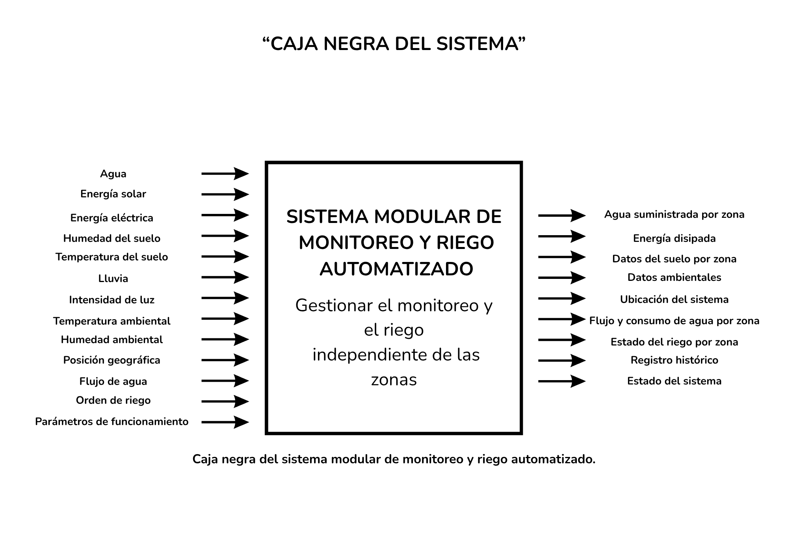
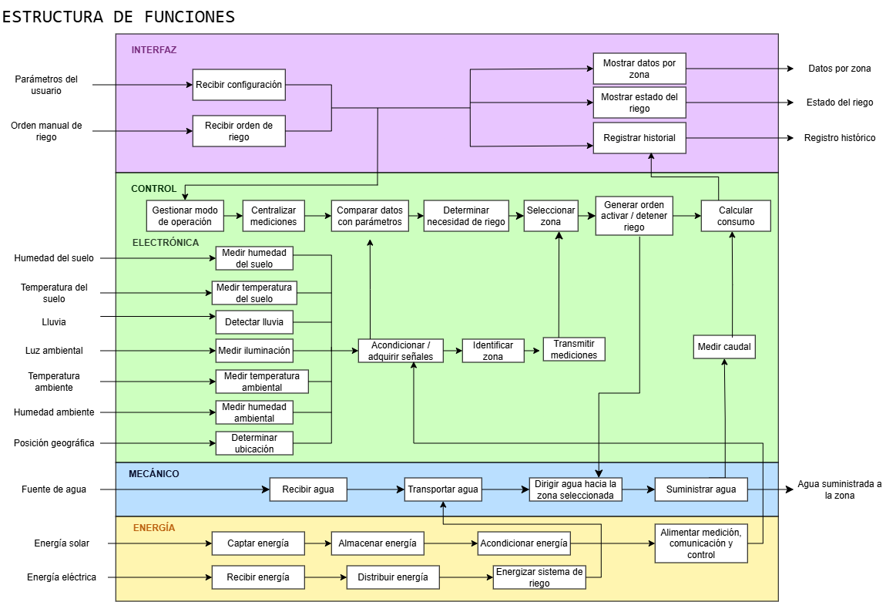

# Taller 7 - Informe de avance

**Curso:** Fundamentos de Diseño  
**Equipo:** 15  
**Proyecto:** Sistema modular de monitoreo y riego automatizado para áreas verdes  
**Integrantes:** Kenneth Samir Ramos Espinoza, Giordano Valentino Valero Bonifacio, Leonardo Pedro Espinoza Flores, Josue Ismael Cardenas Luna y Leonel Willians Sotelo Mamani.

## 1. Problema técnico

Dentro de una misma área verde pueden existir sectores con distinta exposición al sol, humedad del suelo, tipo de planta y capacidad de retención de agua. Si todos los sectores se riegan con el mismo criterio, una zona puede recibir agua aunque todavía conserve suficiente humedad, mientras otra puede requerir riego antes.

El proyecto plantea un sistema modular capaz de medir las condiciones de cada zona, reunir las mediciones en un módulo central, mostrar la información en una plataforma web y controlar el riego de cada sector de forma independiente. Además, se busca registrar el volumen de agua utilizado para poder comparar el comportamiento del sistema con un método de riego de referencia sin asumir previamente un porcentaje de ahorro.

**Pregunta de diseño:** ¿Cómo monitorear y controlar el riego por zonas en áreas verdes de San Martín de Porres, registrando el agua utilizada y permitiendo una instalación modular?

## 2. Desk Research

La matriz de Desk Research reúne fuentes de cuatro ámbitos: patentes, artículos científicos, productos comerciales y tesis. Con estas fuentes se revisaron tecnologías existentes, requisitos, limitaciones y funciones que pueden servir para el proyecto.

| N° | Fuente | Autor/Institución | Año | Referencia | Estado de tecnología encontrado | Exigencia o requisito identificado | Restricción o limitación | Función principal | Aplicación al proyecto |
|:---:|---|---|:---:|---|---|---|---|---|---|
| **1** | **Using a soil moisture sensor-based smart controller for autonomous irrigation management of hybrid bermudagrass with recycled water in coastal Southern California** | Amninder Singh, Amir Verdi, Darren Haver, Anish Sapkota y Jean Claude Iradukunda | 2024 | **[1]** | Estudio de tres años sobre un controlador de riego autónomo basado en humedad del suelo. El sistema utiliza la humedad medida para permitir o detener el riego según límites establecidos. | El sistema debe medir la humedad del suelo por zona y permitir configurar parámetros de riego de acuerdo con las condiciones de cada sector. | El estudio se realizó en bermudagrass, con agua reciclada y bajo condiciones específicas del sur de California. Esos resultados solo muestran lo que ocurrió en esa prueba, así que no sirven para afirmar que en parques de Lima se obtendrá el mismo ahorro. | Medir la humedad del suelo y apoyar la decisión de riego. | Esto sirve como prueba de que la humedad del suelo puede usarse para decidir cuándo una zona necesita riego y para trabajar con parámetros ajustables según sus condiciones. |
| **2** | **Development and validation of a solar-powered IoT drip irrigation system integrating multi-sensor monitoring and threshold control** | S. Falamba, P. G. Home, S. Ondimu y E. Bwambale | 2026 | **[2]** | Sistema de riego IoT basado en ESP32 que integra humedad del suelo, caudal, variables ambientales, comunicación inalámbrica, monitoreo en la nube, control por umbrales y alimentación fotovoltaica. | El sistema debe integrar mediciones de suelo y ambiente, aplicar parámetros para decidir el riego, registrar consumo de agua y permitir alimentación autónoma de los módulos de monitoreo. | Fue validado con tomate en invernadero y con una cantidad limitada de líneas experimentales. El ahorro reportado solo demuestra lo ocurrido en esa prueba, no que nuestro proyecto vaya a obtener el mismo resultado. | Monitorear variables y controlar el riego según parámetros. | Apoya el uso de módulos de monitoreo, medición de caudal, variables ambientales y energía solar. En nuestro sistema el riego por zona se realizará mediante una bomba independiente por línea. |
| **3** | **Soil moisture sensor and controller – US8104498B2** | Daniel D. Dresselhaus y Kevin G. O'Brien / Rain Bird Corporation | 2012 | **[3]** | Patente de un sensor de humedad integrado con un controlador capaz de interrumpir el riego cuando la humedad medida alcanza un límite establecido. | El sistema debe utilizar la humedad del suelo para permitir o detener el riego y trabajar con límites de humedad definidos. | La patente emplea una arquitectura cableada asociada a controladores y válvulas de riego. Esa implementación no corresponde directamente a nuestra comunicación inalámbrica ni al uso de bombas independientes. | Medir humedad y regular el riego según un umbral. | Esto demuestra que la lectura de humedad puede usarse para continuar o detener el riego de una zona. |
| **4** | **Irrigation controller and associated methods – US10969798B2** | Brad J. Wardle, Stuart J. Eyring y Jason R. Sims / Orbit Irrigation Products LLC | 2021 | **[4]** | Patente de un controlador que estima las necesidades de riego de una zona utilizando información del agua en el suelo y parámetros del sistema para definir tiempos de riego. | El sistema debe gestionar cada zona mediante parámetros definidos y permitir que la decisión de riego dependa de sus condiciones hídricas. | Emplea modelos de estimación y programación más complejos que los previstos para el prototipo inicial. La patente no define la misma arquitectura electrónica seleccionada para nuestro proyecto. | Determinar y programar el riego de una zona. | Esto muestra una forma de controlar zonas por separado y trabajar con parámetros distintos para cada una. |
| **5** | **Irrigation system, irrigation sensor and smart scheduling for irrigation, processes, and methods of use – US20250048979A1** | Daniel Zhao / Waterworks Inc. | 2025 | **[5]** | Solicitud de patente que integra múltiples sensores inalámbricos de humedad con controladores de riego y considera información como condiciones meteorológicas, ubicación e historial para modificar la programación. | El sistema debe admitir sensores distribuidos, comunicación inalámbrica, centralización de mediciones y control diferenciado de las zonas. | Es una solicitud de patente pendiente e incorpora aprendizaje automático e inteligencia artificial, tecnologías que exceden el alcance de la primera versión del prototipo. | Recibir mediciones distribuidas y ajustar el riego. | Esto muestra una forma de trabajar con módulos de medición distribuidos que envían información a un sistema central y usan variables ambientales para apoyar la decisión de riego. |
| **6** | **ARC Series Smart Irrigation Controllers** | Rain Bird Corporation | s. f. | **[6]** | Producto comercial Wi-Fi para 4, 6 u 8 estaciones. Permite configurar, supervisar y modificar programas de riego desde una aplicación y ajustar el riego considerando información meteorológica. | El sistema debe permitir identificar y controlar varias zonas independientemente y ofrecer supervisión y control remoto desde una interfaz. | Está diseñado para sistemas residenciales de aspersión y utiliza una infraestructura de riego distinta a la del prototipo. Sus funciones comerciales no sustituyen la validación propia del sistema propuesto. | Gestionar y supervisar varias zonas de riego. | Demuestra que el control multizona y la supervisión remota son funciones ya utilizadas en productos comerciales de riego inteligente. |
| **7** | **Rachio Smart Sprinkler Controller** | Rachio | 2026 | **[7]** | Controlador comercial Wi-Fi disponible para múltiples cantidades de zonas. Es compatible con sensores de lluvia, humedad de suelo y caudal, además de relé para bomba y control mediante aplicación. | El sistema debe permitir varias zonas, integrar mediciones relacionadas con el riego y posibilitar la supervisión remota y el accionamiento de bombas. | Requiere alimentación eléctrica y cobertura Wi-Fi en el lugar. Está diseñado principalmente para sistemas de 24 VAC, por lo que su arquitectura no es igual a la del prototipo. | Centralizar el control de varias zonas. | Este producto muestra que un solo sistema puede manejar varias zonas e integrar sensores, medición de caudal y accionamiento de una bomba. |
| **8** | **Smart Irrigation System Using IoT and LSTM for Optimal Water Management** | Farley Y. Ruiz / University of Texas at Arlington | 2025 | **[8]** | Tesis que integra humedad del suelo, temperatura, humedad ambiental, comunicación inalámbrica, procesamiento central, panel web y control manual dentro de un sistema de riego inteligente. | El sistema debe centralizar las mediciones de los módulos y mostrarlas en una plataforma que permita supervisión, registro y control por parte del usuario. | Utiliza Arduino Nano, Raspberry Pi y un modelo LSTM. El aprendizaje automático y esa arquitectura específica no son necesarios para la primera versión de nuestro proyecto. | Centralizar, procesar y visualizar información para controlar el riego. | Se parece bastante a la separación que planteamos entre módulos de medición, módulo central y plataforma web con control manual. |
| **9** | **Development of a solar-powered soil moisture monitoring node for smart irrigation systems** | Arthur Olemukan / Makerere University | 2025 | **[9]** | Tesis que desarrolla un nodo de monitoreo de humedad del suelo alimentado con energía solar y comunicación LoRa. El nodo fue calibrado y probado en campo para transmitir mediciones a una estación receptora. | Los módulos de monitoreo deben poder trabajar con alimentación autónoma, transmitir sus datos inalámbricamente y ser validados mediante mediciones de referencia. | Utiliza LoRa, Arduino Uno y un sensor tensiométrico diferentes a los componentes seleccionados para nuestro prototipo. El desempeño de la comunicación depende de las condiciones de instalación. | Medir humedad y transmitir datos con alimentación autónoma. | Esto muestra que un módulo de monitoreo puede trabajar con panel solar y batería, pero igual tendremos que probar la medición y la comunicación en condiciones reales. |

**Factores comunes identificados:** En varias fuentes se repiten las mismas ideas: medir la humedad del suelo, separar el riego por zonas, usar parámetros para decidir cuándo regar, reunir la información en un punto central, supervisar el sistema a distancia y medir el agua utilizada. También aparece varias veces el uso de comunicación inalámbrica y alimentación autónoma en los módulos. Esto coincide con lo que planteamos para el prototipo: módulos de suelo por zona, módulo central, plataforma web, medición de caudal y control independiente de bombas.

## Referencias

[1] Singh A, Verdi A, Haver D, Sapkota A, Iradukunda JC. Using a soil moisture sensor-based smart controller for autonomous irrigation management of hybrid bermudagrass with recycled water in coastal Southern California. Agric Water Manag. 2024;299:108906. doi:10.1016/j.agwat.2024.108906.

[2] Falamba S, Home PG, Ondimu S, Bwambale E. Development and validation of a solar-powered IoT drip irrigation system integrating multi-sensor monitoring and threshold control. Smart Agric Technol. 2026;14:102402. doi:10.1016/j.atech.2026.102402.

[3] Dresselhaus DD, O'Brien KG, inventors; Rain Bird Corporation, assignee. Soil moisture sensor and controller. United States patent US8104498B2. 2012 Jan 31. Available from: https://patents.google.com/patent/US8104498B2/en

[4] Wardle BJ, Eyring SJ, Sims JR, inventors; Orbit Irrigation Products LLC, original assignee. Irrigation controller and associated methods. United States patent US10969798B2. 2021 Apr 6. Available from: https://patents.google.com/patent/US10969798B2/en

[5] Zhao D, inventor; Waterworks Inc., assignee. Irrigation system, irrigation sensor and smart scheduling for irrigation, processes, and methods of use. United States patent application US20250048979A1. 2025 Feb 13. Available from: https://patents.google.com/patent/US20250048979A1/en

[6] Rain Bird Corporation. ARC Series Smart Irrigation Controllers [Internet]. Azusa (CA): Rain Bird Corporation; [cited 2026 Sep 29]. Available from: https://www.rainbird.com/products/arc-series-smart-irrigation-controllers

[7] Rachio. Rachio Sprinkler Controller Models & Tech Specs [Internet]. Denver (CO): Rachio; 2026 [cited 2026 Sep 29]. Available from: https://support.rachio.com/en_us/rachio-sprinkler-controller-models-tech-specs-HyfTxF0YY

[8] Ruiz FY. Smart irrigation system using IoT and LSTM for optimal water management [master's thesis on the Internet]. Arlington (TX): University of Texas at Arlington; 2025 [cited 2026 Sep 29]. Available from: https://mavmatrix.uta.edu/electricaleng_theses/399/

[9] Olemukan A. Development of a solar-powered soil moisture monitoring node for smart irrigation systems [undergraduate dissertation on the Internet]. Kampala (Uganda): Makerere University; 2025 [cited 2026 Sep 29]. Available from: https://dissertations.mak.ac.ug/handle/20.500.12281/20661

## 3. Lista de exigencias

La lista de exigencias reúne las condiciones que tiene que cumplir el sistema y separa los requisitos obligatorios de los deseos de diseño.

| N.° | Tipo | Exigencia | Especificación / criterio verificable |
|:---:|---|---|---|
| 1 | Exigencia | Medición de humedad del suelo | Cada zona contará con un sensor de humedad del suelo conectado a su módulo de medición. |
| 2 | Exigencia | Medición de temperatura del suelo | Cada zona contará con medición de temperatura del suelo. |
| 3 | Exigencia | Módulos de medición por zona | Cada zona utilizará un ESP32-C3 SuperMini para adquirir y procesar las mediciones locales. |
| 4 | Exigencia | Módulo central | El sistema contará con un ESP32-S como módulo central para recibir datos de los módulos de zona y comunicarse con la plataforma. |
| 5 | Exigencia | Detección de lluvia | El módulo central deberá detectar presencia de lluvia. |
| 6 | Exigencia | Medición de luz ambiental | El módulo central deberá medir la intensidad de luz ambiental. |
| 7 | Exigencia | Temperatura y humedad ambiental | El módulo central deberá medir temperatura y humedad del ambiente. |
| 8 | Exigencia | Posición geográfica | El módulo central deberá obtener la ubicación mediante GPS. |
| 9 | Exigencia | Comunicación entre módulos | Los módulos de zona deberán comunicarse con el módulo central mediante ESP-NOW. |
| 10 | Exigencia | Comunicación con la plataforma | El módulo central deberá conectarse por Wi-Fi para enviar datos a la plataforma web. |
| 11 | Exigencia | Frecuencia de actualización | La información del sistema deberá actualizarse en intervalos de hasta 5 minutos durante la operación normal. |
| 12 | Exigencia | Identificación de zonas | Cada módulo y cada registro deberán estar asociados a una zona identificable. |
| 13 | Exigencia | Riego independiente | El sistema deberá permitir activar o detener el riego de cada zona de manera independiente. |
| 14 | Exigencia | Bomba por línea de riego | Cada línea o zona de riego contará con una bomba independiente. |
| 15 | Exigencia | Control de múltiples bombas | Un controlador de riego basado en ESP32 deberá poder manejar varias bombas mediante canales de control independientes. |
| 16 | Exigencia | Alimentación de bombas | Las bombas utilizarán una fuente eléctrica directa independiente de la alimentación solar de los módulos de monitoreo. |
| 17 | Exigencia | Medición de caudal | Cada línea de riego contará con medición de caudal ubicada en la salida o boquilla de la manguera. |
| 18 | Exigencia | Separación del agua y electrónica | Los controladores y componentes electrónicos deberán mantenerse protegidos y alejados de las salidas de agua. |
| 19 | Exigencia | Control remoto | La plataforma deberá permitir solicitar la activación o detención del riego de una zona seleccionada. |
| 20 | Exigencia | Control automático | El sistema deberá poder decidir el riego utilizando las mediciones y los parámetros configurados para cada zona. |
| 21 | Exigencia | Monitoreo por zona | La plataforma deberá mostrar como mínimo humedad del suelo, temperatura del suelo, estado de riego y consumo de agua por zona. |
| 22 | Exigencia | Monitoreo ambiental y ubicación | La plataforma deberá mostrar lluvia, luz, temperatura y humedad ambiental, además de la ubicación del sistema. |
| 23 | Exigencia | Registro histórico | El sistema deberá almacenar como mínimo zona, fecha, hora, mediciones, estado de riego y volumen de agua registrado. |
| 24 | Exigencia | Alimentación autónoma de monitoreo | Los módulos de monitoreo deberán utilizar panel solar y batería recargable. |
| 25 | Exigencia | Gestión de energía | Los módulos deberán incluir gestión de carga y estrategias de bajo consumo cuando no estén realizando mediciones o transmisiones. |
| 26 | Exigencia | Protección para exteriores | La electrónica de los módulos exteriores deberá instalarse en una cubierta que la proteja de humedad y salpicaduras. |
| 27 | Exigencia | Validación de mediciones | Las mediciones deberán comprobarse bajo condiciones diferenciadas de humedad y temperatura para verificar que el sistema detecta cambios reales. |
| 28 | Exigencia | Validación del riego independiente | En las pruebas deberá comprobarse que una orden destinada a una zona activa únicamente la bomba correspondiente. |
| 29 | Exigencia | Comparación de consumo | El sistema deberá registrar litros por zona para comparar el consumo del riego propuesto con un método de referencia bajo condiciones comparables. |
| 30 | Deseo | Escalabilidad | Se desea poder añadir nuevas zonas sin rediseñar completamente el sistema. |
| 31 | Deseo | Facilidad de mantenimiento | Se desea que sensores, módulos y elementos de riego puedan revisarse o sustituirse sin desmontar todo el sistema. |
| 32 | Deseo | Bajo costo | Se desea reducir el costo de componentes e instalación sin impedir el cumplimiento de las exigencias obligatorias. |
| 33 | Deseo | Facilidad de instalación | Se desea que los módulos puedan instalarse con pocas modificaciones en el área verde seleccionada. |
| 34 | Deseo | Diseño compacto | Se desea mantener un tamaño reducido en los módulos para facilitar su instalación y protección. |

## 4. Caja negra

La caja negra representa el sistema sin mostrar todavía sus componentes internos. Las entradas se agrupan en materia, energía e información; el sistema transforma estas entradas para generar agua suministrada por zona y datos de monitoreo, consumo y estado del riego.

*Figura 1. Caja negra del sistema modular de monitoreo y riego automatizado.*

## 5. Estructura de funciones

La función general del sistema se dividió en subfunciones agrupadas en cinco dominios: interfaz, control, electrónica, mecánica y energía. La estructura relaciona la adquisición de variables, la centralización de mediciones, la decisión de riego, el suministro de agua, la medición de caudal y la alimentación de los diferentes subsistemas.

*Figura 2. Estructura de funciones o caja blanca del sistema.*

El recorrido funcional principal puede resumirse como:

**Medir variables -> transmitir y centralizar datos -> comparar con parámetros -> determinar necesidad de riego -> seleccionar zona -> activar o detener el riego -> medir caudal -> registrar consumo e historial.**

La alimentación también se separa funcionalmente: la energía solar se destina a la medición, comunicación y control de los módulos de monitoreo, mientras que la energía eléctrica directa alimenta el sistema de riego.

## 6. Conclusión

Al revisar las fuentes vimos varios puntos que se repiten en sistemas de riego inteligente: medir la humedad por zona, controlar cada zona por separado, usar comunicación inalámbrica, guardar datos y medir el agua utilizada. Con esa información se definieron las exigencias del proyecto y se armó la caja negra y la estructura de funciones.

Con esto ya tenemos una base funcional antes de elegir soluciones específicas para cada función. La siguiente etapa será probar las mediciones, la comunicación entre módulos, la activación independiente de las bombas y el registro del consumo de agua en condiciones controladas.
